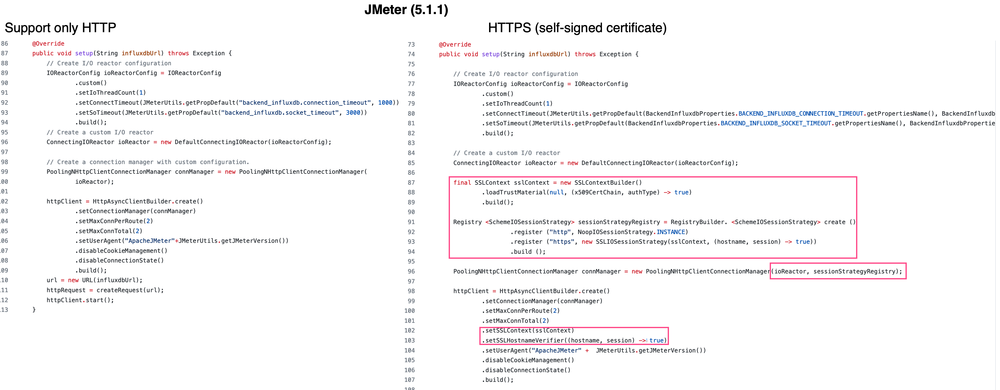

# Implementation of custom HTTPS sender for JMeter and InfluxDB
**Tags:** JMeter; InfluxDB; Grafana; InfluxDBBackendListenerClient; HttpMetricsSender; HTTPS; TSL; self-signed certificate

## Objective
&nbsp;&nbsp;&nbsp;&nbsp;&nbsp;&nbsp;Cyber-security - today everyone is concerned about it, whether you are just a user or a company. This topic touched me at work in the first place, in a project with JMeter + InfluxDB + Grafana.<br/>
&nbsp;&nbsp;&nbsp;&nbsp;&nbsp;&nbsp;I use these tools to monitor performance tests in real-time. Many have been said and talked about them, both on the project sites themselves (I will give links below) and simply on the Internet. I will give my example of the transition of the InfluxDB server from HTTP to HTTPS protocol that influenced the use of the standard Backend Listeners in JMeter.<br/>
&nbsp;&nbsp;&nbsp;&nbsp;&nbsp;&nbsp;I must say right away that I had to slightly tweak the existing implementation of sending data from JMeter to InfluxDB. But if you solve this problem differently, I am always happy to accept criticism or see other ways to solve this problem.<br/>
&nbsp;&nbsp;&nbsp;&nbsp;&nbsp;&nbsp;The regular InfluxdbBackendListenerClient (with <b>HttpMetricsSender</b>) will throw exception in JMeter if the InfluxDB server support only <b>HTTPS</b>.<br/>
&nbsp;&nbsp;&nbsp;&nbsp;&nbsp;&nbsp;I will share how I solved this problem by implementing a slightly modified HttpMetricsSender that supports HTTPS (especially self-signed certificates).

## HTTPS & HTTPS
&nbsp;&nbsp;&nbsp;&nbsp;&nbsp;&nbsp;**HTTP** stands for Hypertext Transfer Protocol. When you enter **http://** in your address bar in front of the domain, it tells the browser to connect over **HTTP**. 
**HTTP** uses **TCP** (Transmission Control Protocol), generally over port 80, to send and receive data packets over the web.<br/>
&nbsp;&nbsp;&nbsp;&nbsp;&nbsp;&nbsp;**HTTPS** (Hypertext Transfer Protocol Secure) is HTTP with encryption. The difference between the two protocols is that **HTTPS** uses **TLS** (**SSL**) to encrypt normal HTTP requests and responses. As a result, **HTTPS** is far more secure than HTTP, an attacker would see a series of seemingly random characters.<br/>
&nbsp;&nbsp;&nbsp;&nbsp;&nbsp;&nbsp;**TLS** uses a technology called public key encryption: there are two keys, a public key and a private key. The public key is shared with client devices via the server's **SSL** certificate. The certificates are cryptographically signed by a Certificate Authority (CA), and each browser has a list of CAs it implicitly trusts. Any certificate signed by a CA in the trusted list is given a green padlock lock in the browser’s address bar, because it is proven to be “trusted” and belongs to that domain. Companies like Let’s Encrypt have now made the process of issuing **SSL/TLS** certificates free.<br/>
&nbsp;&nbsp;&nbsp;&nbsp;&nbsp;&nbsp;The self-signed certificate is a security certificate that is not signed by a certificate authority (CA). These certificates are easy to make and do not cost money. However, they do not provide all of the security properties that certificates signed by a CA aim to provide.

## JMeter + InfluxDB + Grafana
&nbsp;&nbsp;&nbsp;&nbsp;&nbsp;&nbsp;The Apache JMeter™ application is open-source software designed to load test functional behavior and measure performance. It was originally designed for testing Web Applications.

<br/>
&nbsp;&nbsp;&nbsp;&nbsp;&nbsp;&nbsp;&nbsp;&nbsp;&nbsp;&nbsp;&nbsp;&nbsp;&nbsp;&nbsp;&nbsp;&nbsp;&nbsp;&nbsp;&nbsp;&nbsp;&nbsp;&nbsp;&nbsp;&nbsp;&nbsp;&nbsp;&nbsp;&nbsp;&nbsp;&nbsp;&nbsp;&nbsp;&nbsp;&nbsp;&nbsp;&nbsp;&nbsp;&nbsp;&nbsp;&nbsp;&nbsp;&nbsp;_Figure 1. JMeter + InfluxDB + Grafana_

&nbsp;&nbsp;&nbsp;&nbsp;&nbsp;&nbsp;Since JMeter 3.2 you can get real-time results, send metrics to an InfluxDB using UDP or HTTP protocols. This feature provides:
1.  Live results;
2.  Nice graphs for metrics;
3.  Ability to compare 2 or more load tests;
4.  Ability to add annotations to graphs;
5.  Storing monitoring data as long as JMeter results in the same backend.

&nbsp;&nbsp;&nbsp;&nbsp;&nbsp;&nbsp;InfluxDB sender base on The Line Protocol. The Line Protocol is a text based format for writing points to InfluxDB.<br/>
Syntax:

```
measurement(,tag_key=tag_val)* field_key=field_val(,field_key_n=field_value_n)* (nanoseconds-timestamp)?
```
```
weather,location=us-midwest temperature=82 1465839830100400200
```
&nbsp;&nbsp;&nbsp;&nbsp;&nbsp;&nbsp;Each line, separated by the newline character, represents a single point in InfluxDB. InfluxDB accepts data via HTTP, TCP, and UDP. The Line Protocol is whitespace sensitive (link).

")<br/>
&nbsp;&nbsp;&nbsp;&nbsp;&nbsp;&nbsp;&nbsp;&nbsp;&nbsp;&nbsp;&nbsp;&nbsp;&nbsp;&nbsp;&nbsp;&nbsp;&nbsp;&nbsp;&nbsp;&nbsp;&nbsp;&nbsp;&nbsp;&nbsp;&nbsp;&nbsp;&nbsp;&nbsp;&nbsp;&nbsp;&nbsp;&nbsp;&nbsp;&nbsp;&nbsp;&nbsp;&nbsp;&nbsp;&nbsp;&nbsp;&nbsp;&nbsp;_Figure 2. JMeter. InfluxdbBackendListenerClient (default HttpMetricsSender)_


In Figure 2, you can see the JMeter **Backend Listener** configured for InfluxDB for the **HTTP** protocol. Three settings are responsible for this (they are marked in the figure):
1)  Drop down menu [ Backend Listener implementation ];
2)  parameter [ influxdbMetricsSender ] – in our case it’s [ org.apache.jmeter.visualizers.backend.influxdb.HttpMetricsSender ];
3)  parameter [ influxdbUrl ] – like you can see it’s [ HTTP ] in the URL.

&nbsp;&nbsp;&nbsp;&nbsp;&nbsp;&nbsp;But if your InfluxDB server supports only the **HTTPS** protocol, and even with a self-signed certificate, then you will see this error in JMeter logs:
```
2021-11-26 14:58:25,465 ERROR o.a.j.v.b.i.HttpMetricsSender: failed to send data to influxDB server : General SSLEngine problem
2021-11-26 14:58:25,465 ERROR o.a.j.v.b.i.HttpMetricsSender: Error waiting for last request to be send to InfluxDB
java.util.concurrent.ExecutionException: javax.net.ssl.SSLHandshakeException: General SSLEngine problem
....
Caused by: sun.security.provider.certpath.SunCertPathBuilderException: unable to find valid certification path to requested target
    at sun.security.provider.certpath.SunCertPathBuilder.build(SunCertPathBuilder.java:141) ~[?:1.8.0_201]
    at sun.security.provider.certpath.SunCertPathBuilder.engineBuild(SunCertPathBuilder.java:126) ~[?:1.8.0_201]
```

&nbsp;&nbsp;&nbsp;&nbsp;&nbsp;&nbsp;Well, I've wanted to dig into the internals of JMeter for a long time, now we have a reason. And I decided not only to dig but also slightly modify the existing implementation.<br/>
&nbsp;&nbsp;&nbsp;&nbsp;&nbsp;&nbsp;Class [ org.apache.jmeter.visualizers.backend.influxdb.HttpMetricsSender ] has default (package) access modifier. So you can't inherit it and override just one method [HttpsMetricsSender#setup]. Please, ping me if you can do it using reflection.<br/>
&nbsp;&nbsp;&nbsp;&nbsp;&nbsp;&nbsp;The method [ HttpsMetricsSender#setup ] contains the **HTTP** client implementation, and it is responsible for working with **TSL**. In Figure 3 - you can see my major updates for supporting **HTTPS** (for self-signed certificate).

<br/>
&nbsp;&nbsp;&nbsp;&nbsp;&nbsp;&nbsp;&nbsp;&nbsp;&nbsp;&nbsp;&nbsp;&nbsp;&nbsp;&nbsp;&nbsp;&nbsp;&nbsp;&nbsp;&nbsp;&nbsp;&nbsp;&nbsp;&nbsp;&nbsp;&nbsp;&nbsp;&nbsp;&nbsp;&nbsp;&nbsp;&nbsp;&nbsp;&nbsp;&nbsp;&nbsp;&nbsp;&nbsp;&nbsp;&nbsp;&nbsp;&nbsp;&nbsp;_Figure 3. Diff in HttpMetricsSender#setup and HttpsMetricsSender#setup implementation_

&nbsp;&nbsp;&nbsp;&nbsp;&nbsp;&nbsp;The new implementation is the most straightforward Maven project, and you can find more information in [README.md](../README.md). To generate an artifact (*** .jar**), we just need to run the command:<br/>
`$\> mvn clean install` – it will generate java archive and install it in local **M2** repository.<br/>
Or<br/>
`$\> mvn clean deploy` – it will generate java archive and additional deployed it to the repository (what should be configured in [ ~/.m2/settings.xml ]).

&nbsp;&nbsp;&nbsp;&nbsp;&nbsp;&nbsp;Depending on how you configure JMeter, you can: 
1. Copy the received artifact [ jmeter-https-metrics-0.0.1-SNAPSHOT.jar ] to the folder [ $JMETER_HOME\lib\ext\ ] 
2. Or specify the dependency in the **pom.xml** - if you are using the [jmeter-maven plugin](https://github.com/jmeter-maven-plugin/jmeter-maven-plugin).

<br/>
&nbsp;&nbsp;&nbsp;&nbsp;&nbsp;&nbsp;&nbsp;&nbsp;&nbsp;&nbsp;&nbsp;&nbsp;&nbsp;&nbsp;&nbsp;&nbsp;&nbsp;&nbsp;&nbsp;&nbsp;&nbsp;&nbsp;&nbsp;&nbsp;&nbsp;&nbsp;&nbsp;&nbsp;&nbsp;&nbsp;&nbsp;&nbsp;&nbsp;&nbsp;&nbsp;&nbsp;&nbsp;&nbsp;&nbsp;&nbsp;&nbsp;&nbsp;_Figure 4. JMeter. Add new dependency in **pom.xml**_

&nbsp;&nbsp;&nbsp;&nbsp;&nbsp;&nbsp;After completing the necessary steps, we can open JMeter and configure the modified implementation (see Figure 5).

")<br/>
&nbsp;&nbsp;&nbsp;&nbsp;&nbsp;&nbsp;&nbsp;&nbsp;&nbsp;&nbsp;&nbsp;&nbsp;&nbsp;&nbsp;&nbsp;&nbsp;&nbsp;&nbsp;&nbsp;&nbsp;&nbsp;&nbsp;&nbsp;&nbsp;&nbsp;&nbsp;&nbsp;&nbsp;&nbsp;&nbsp;&nbsp;&nbsp;&nbsp;&nbsp;&nbsp;&nbsp;&nbsp;&nbsp;&nbsp;&nbsp;&nbsp;&nbsp;_Figure 5. JMeter. InfluxdbBackendListenerClient (HttpsMetricsSender)_


&nbsp;&nbsp;&nbsp;&nbsp;&nbsp;&nbsp;Figure 5 shows how the same, but new **Backend Listener** will look, but with custom implementation settings.

## Conclusion
&nbsp;&nbsp;&nbsp;&nbsp;&nbsp;&nbsp;I would like to say a big Thank you, to the DevOps, to move the InfluxDB to **HTTPS** protocol configuration - it's push me out from my comfort zone and give me opportunity to discover JMeter source code . No sarcasm - really thanks.<br/>
&nbsp;&nbsp;&nbsp;&nbsp;&nbsp;&nbsp;The JMeter sends samplers metrics information and not any sensitive data (from request / response) in InfluxDB, but any case now we are more safe. The supporting **HTTPS** protocol in the JMeter **InfluxdbBackendListenerClient** give us the theoretical opportunity to send and debug information (what can contain some sensitive information) due to dry run and integrate JMeter with another reporting systems like [ReportPortal](https://reportportal.io/) for example, but this story will be covered in the next articles. 

<br/>
<br/>

**Appendix A.** Docker compose file for InfluxDB (HTTP) and Grafana servers

```YAML
version: "3"

services:

  grafana:
    image: grafana/grafana:7.1.5
    container_name: grafana_container
    restart: always
    ports:
      - 3000:3000
    networks:
      - monitoring_network
    volumes:
      - grafana-volume:/var/lib/grafana
    environment:
      - GF_PLUGIN_GRAFANA_IMAGE_RENDERER_RENDERING_IGNORE_HTTPS_ERRORS=true
      - GF_SECURITY_ADMIN_USER=${GF_ADMIN_USER}
      - GF_SECURITY_ADMIN_PASSWORD=${GF_ADMIN_PASSWORD}
    depends_on:
      - influxdb
    links:
      - influxdb:influxdb
# URL http://influxdb:8086/

  influxdb:
    image: influxdb
    container_name: influxdb_container
    restart: always
    ports:
      - 8083:8083
      - 8086:8086
    networks:
      - monitoring_network
    volumes:
      - influxdb-volume:/var/lib/influxdb
    environment:
      - INFLUXDB_DB=g2_perf
      - INFLUXDB_HTTP_AUTH_ENABLED=true
      - INFLUXDB_REPORTING_DISABLED=true
      - INFLUXDB_DATA_QUERY_LOG_ENABLED=false
      - INFLUXDB_READ_USER=${INFLUXDB_READ_USER}
      - INFLUXDB_READ_USER_PASSWORD=${INFLUXDB_READ_USER_PASSWORD}
      - INFLUXDB_WRITE_USER=${INFLUXDB_WRITE_USER}
      - INFLUXDB_WRITE_USER_PASSWORD=${INFLUXDB_WRITE_USER_PASSWORD}
      - INFLUXDB_ADMIN_ENABLED=true
      - INFLUXDB_ADMIN_USER=${INFLUXDB_ADMIN_USER}
      - INFLUXDB_ADMIN_PASSWORD=${INFLUXDB_ADMIN_PASSWORD}

networks:
  monitoring_network:
volumes:
  grafana-volume:
    external: false
  influxdb-volume:
    external: false
```


## References
1. [JMeter. Real-time results](https://jmeter.apache.org/usermanual/realtime-results.html)
2. [InfluxData](https://www.influxdata.com/influxdb-templates/apache-jmeter/)
3. [Grafana](https://grafana.com/grafana/dashboards/1152)
4. [HttpMetricsSender](https://github.com/apache/jmeter/blob/master/src/components/src/main/java/org/apache/jmeter/visualizers/backend/influxdb/HttpMetricsSender.java)
5. [InfluxdbBackendListenerClient](https://github.com/apache/jmeter/blob/master/src/components/src/main/java/org/apache/jmeter/visualizers/backend/influxdb/InfluxdbBackendListenerClient.java)
6. [InfluxDB](https://en.wikipedia.org/wiki/InfluxDB)


[BACK](../README.md)